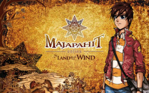

MOKV is made with [PlayerIO](https://playerio.com) backend service.

## Summary

### GameFS

PlayerIO has virtual file system called [GameFS](https://playerio.com/features/gamefs/) that games can access to from network. Every game-related files and assets lives here.

The access to GameFS can be done via PlayerIO client (provided from PlayerIO SDK) from the game's SWF. You would need a `gameId`, a unique identifier given to developers upon registering an account in PlayerIO. We can also download files directly with HTTP requests, that is by knowing the PlayerIO CDN URL, or the back-facing cloud URL, the `gameId` to include in the path, and the path that leads to the file itself.

There are two known `gameId` of MOKV (usually each game only have one):
- `mo-kshatriya-varna-gk7jceiwuk5cgydq4frqw`
- `mo-kshatriya-varna-pghdt52hrue7uvjdoioika`

If the PlayerIO CDN is
- `http://cdn.playerio.com` and `http://r.playerio.com/r/`, then file directory would be in
- `http://cdn.playerio.com/mo-kshatriya-varna-gk7jceiwuk5cgydq4frqw/`, and
- `http://r.playerio.com/r/mo-kshatriya-varna-gk7jceiwuk5cgydq4frqw/`.

For example, the URL to the core file `MOKV.swf`:
- `http://r.playerio.com/r/mo-kshatriya-varna-gk7jceiwuk5cgydq4frqw/MOKV.swf`

We can also use the back-facing cloud URL (the `r.playerio.com` typically limits request):
- `d1ro1du4c73r1c.cloudfront.net/mo-kshatriya-varna-gk7jceiwuk5cgydq4frqw/MOKV.swf`

### MOKV Website

MOKV used to be hosted in its own website and Kongregate. Our private server decided to use the old MOKV website by Anantarupa.

### Redirection

MOKV uses `Preloader.swf` to setup security before loading the `MOKV.swf` game:
- reads `crossdomain.xml`.
- setup CDN URLs.
- allow CDN domain and hosts.

We may edit the URL in preloader to redirect it to our local server. Below are list of redirected links.

1. `http://cdn.playerio.com/mo-kshatriya-varna-gk7jceiwuk5cgydq4frqw/` -> `http://127.0.0.1:8080/game/`
2. `http://r.playerio.com/r/mo-kshatriya-varna-gk7jceiwuk5cgydq4frqw/` -> `http://127.0.0.1:8080/game/`
3. `http://cdn.playerio.com/mo-kshatriya-varna-pghdt52hrue7uvjdoioika/` -> `http://127.0.0.1:8080/game/`
4. `http://r.playerio.com/r/mo-kshatriya-varna-pghdt52hrue7uvjdoioika/` -> `http://127.0.0.1:8080/game/`
5. `http://cdn.playerio.com/crossdomain.xml` -> `http://127.0.0.1:8080/crossdomain.xml`
6. `http://www.kongregate.com/flash/API_AS3_Local.swf` -> `http://127.0.0.1:8080/kong/API_AS3_Local.swf` (kong only)
7. `http://r.playerio.com/r/mo-kshatriya-varna-gk7jceiwuk5cgydq4frqw/MOKV-Kongregate.swf` -> `http://127.0.0.1:8080/game/MOKV-Kongregate.swf` (kong only)
8. `http://r.playerio.com/r/mo-kshatriya-varna-gk7jceiwuk5cgydq4frqw/MOKV.swf` -> `http://127.0.0.1:8080/game/MOKV.swf`
